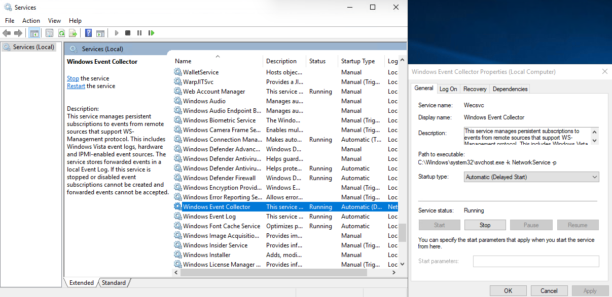
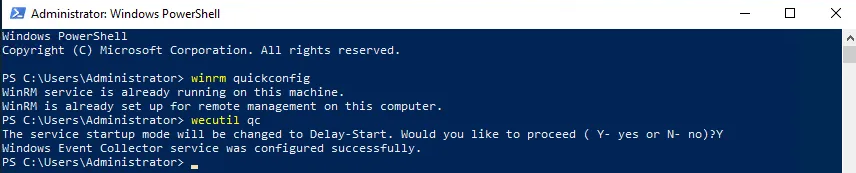
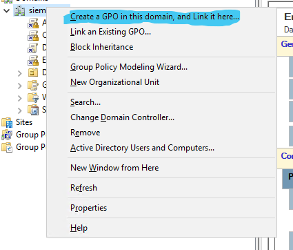
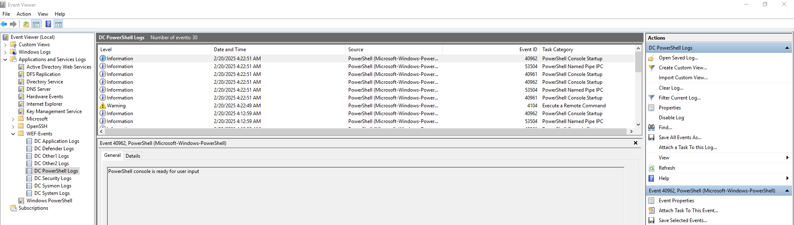

# WEF & WEC Configuration Guide

## Overview
Windows Event Forwarding (WEF) and Windows Event Collector (WEC) allow organizations to centralize Windows event logs for better security monitoring, incident response, and compliance. This guide provides a step-by-step setup to configure WEF and WEC properly.

## Prerequisites
### System Requirements
- **Windows Server** (for WEC)
- **Windows Clients** (for WEF)
- **Active Directory** (for domain-based deployment)
- **Domain Admin privileges** (recommended for setup)

<br><br>
## On Windows Server (WEC Machine)

1. Enable the service “Windows Event Collector”

    Firstly, we should enable “Windows Event Collector” service in Services tab. 

    Change the Startup type to the `Automatic (Delayed Start)`

    

2. **Add the network service account to the domain**
    1. In `Active Directory Users and Computers`, go to the **`Builtin`** folder and double-click **`Event Log Readers`**.
    2. Select **`Members`**.
    3. If **Network Service** is not listed, select **Add**, and then enter **Network Service**.
    4. Select **Check Names** and select **OK** twice. 
    

3. Configure WinRM 
    1. Run these commands on Powershell as Administrator
    
        ```bash
        winrm quickconfig 
        wecutil qc
        ```
    

        

4. Create Custom Event Providers (Optional)
    1. Move these files to your system32 folder and run the following command:
        
        `wevtutil im C:\Windows\System32\WEF_Events.man` 
        
        You can find these files in the **Config_Files** folder.
        
    
        After running this command, the following channels must be created under **WEF-Events** in the Event Viewer. I have chosen these channels for testing purposes and have also tried to select the most commonly used event types. If you want to customize them, you can refer to this [guide](https://github.com/jebidiah-anthony/Windows-Event-Forwarder/blob/master/Creating%20Custom%20Logs.md). 
    
        
    

5. Apply GPO to config Agents
    1. Enable WINRM on Agents 
       1. Firstly, create new GPO and link to the OU. And then right click and edit the GPO. 
            !
        1.  Expand the **Computer Configuration > Policies > Administrative Templates > Windows Components > Windows Remote Management (WinRM) > WinRM Service** 
         <br>   On the right side, locate and edit the **Allow remote server management through WinRM** policy setting. 
            
            
            
            Set to Enabled and add the “*” to both IPv4 and IPv6 filter.
            
            
            
        2. The next policy that needs to be configured is the one responsible for enabling and starting the WinRM service. Expand **Computer Configuration >  Preferences > Control Panel Settings > Services**. Right-click the **Services** section and choose **New > Service**. Change the StartUp type to "Automatic (Delayed Start)" and Service action to the "Start Service"
            
            
            
        3. The final policy we need to configure for WinRM to function is opening the appropriate **Firewall** ports. Expand **Computer Configuration > Policies > Windows Settings > Security Settings > Windows Defender Firewall with Advanced Security > Windows Defender Firewall with Advanced Security > Inbound** **Rules**. Right-click the **Inbound Rules** section and choose **New Rule**.
            
            
            
            On the **New Inbound Rule Wizard** click **Predefined** then from the list select **Windows Remote Management**.
            
            
            
            In the **Predefined Rules** window, ensure that the **Public profile** box is unchecked. While this doesn’t expose you to the internet—since your company already has a firewall in place—it is considered a best practice.
            
            
            
            Proceed with the default option by allowing the connection.
            
            
            
        GPO settings for double check:

        - “Enable Winrm”     
          - Firewall:
            
            
        
          - WinRM Service:
        
            
        
            
            
    3.  Add `Network Service` account to the Agents’ Local Group
        
        
        
        
        
        Then add `Network Service` user to the group. Double click the `OK` and then click `Apply` button.
        
        
        
        “Add `Network Service` account to the Agents’ Local Group” — GPO settings - for double check:
        
        
        
    4. Then run `gpupdate.exe` on PowerShell as Administrator or reboot the clients to take effect.  <br><br>
    

1. Configure a Subscription
    1. **Collector Initiated** - In this method, WEC server will connect to the agents and collect events with privileged user. 
        - In the Event Viewer, Click the `Subscriptions` (on the bottom)
        - Click the `Create Subscription`
  
            

        - Choose relevant Destination Log
            
            
            
        - Add domain computers
            
            
            
            After clicking OK you can check also the connectivity. 
            
            
            
        - Selecting Relevant Events
            
            
            
        
        - Specifying the privileged account
            
            Triple click the `OK` button.
            
            
            
        - Check the runtime status
            - Click the Right button of the mouse on the subscription and check the status of the Subscription.
            
            <br><br><br>
    2. **Source Initiated** -- In this method, all agents send events to the WEC Server
        
        For this config we should do some extra staff. 
        
        1. Firstly, run these commands in the PowerShell (WEC Server):
            
            ```bash
            netsh http delete urlacl url=http://+:5985/wsman/
            
            netsh http add urlacl url=http://+:5985/wsman/ sddl="D:(A;;GX;;;S-1-5-80-569256582-2953403351-2909559716-1301513147-412116970)(A;;GX;;;S-1-5-80-4059739203-877974739-1245631912-527174227-2996563517)"
            ```
            
        2. Then add GPO to enable Subscription manager on agents.
            
            **Computer Configuration > Policies > Administrative Templates > Windows Components > Event Forwarding**
            
            Add this value:
            
            `Server=http://dc.siem.local:5985/wsman/SubscriptionManager/WEC,Refresh=10` 
            
            
            
            Click `OK` and then `Apply` button. Here you should specify the WEC server FQDN (In my case I have used DC you can use another server) 
            
        3. Now you can create the source based Subscriptions
            1. This is the same process with the (6. — a.) but here we choose `Source Computer initiated.` 
                
                
                
                You can add the desired OUs here. And no need to specify the privileged account credentials in this solution.  
                
            
        <br><br>
    After creating Subscription you can check the connected Agents status by checking `Runtime Status`
    <br><br>

        After a while all logs will start coming to your specified destinations.
         <br><br><br>

## References
- [Microsoft Docs: Windows Event Collection](https://learn.microsoft.com/en-us/advanced-threat-analytics/configure-event-collection)
- [CREATING CUSTOM LOGS FOR WINDOWS EVENT FORWARDER](https://github.com/jebidiah-anthony/Windows-Event-Forwarder/blob/master/Creating%20Custom%20Logs.md)
- [How to enable WinRM (HTTP) via Group Policy](https://www.vkernel.ro/blog/how-to-enable-winrm-http-via-group-policy)

<br><br>
    This guide was created to help security professionals, SOC teams, and system administrators streamline Windows event log collection. By following these steps, you can enhance visibility, strengthen security monitoring, and optimize incident response.

<br>


🚀 **Stay Secure & Keep Monitoring!** 🔍🔐

